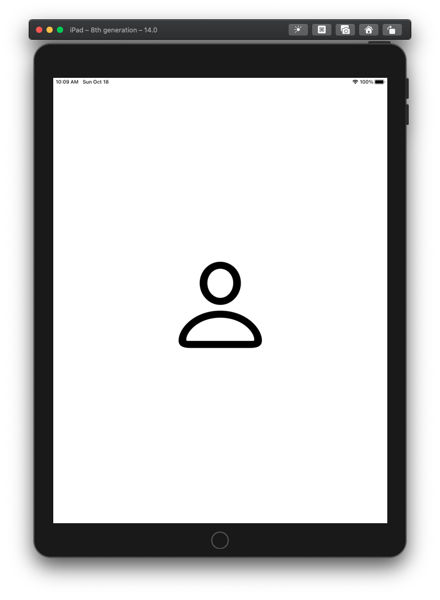
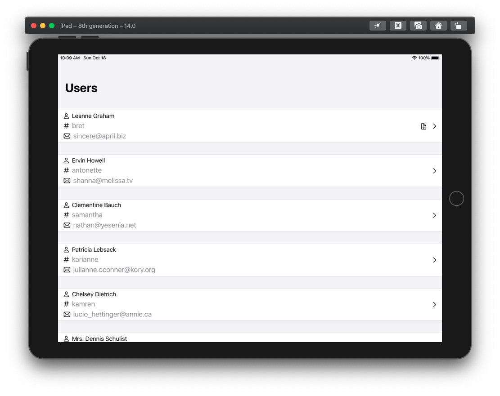
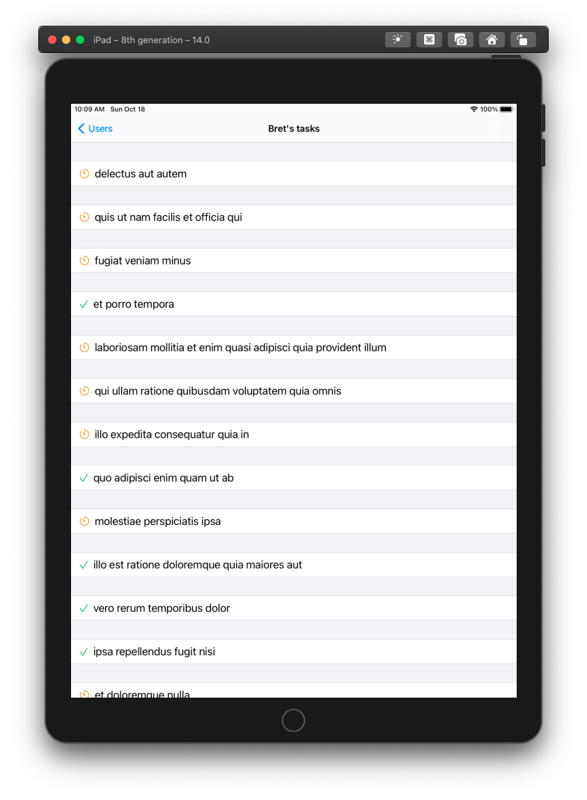
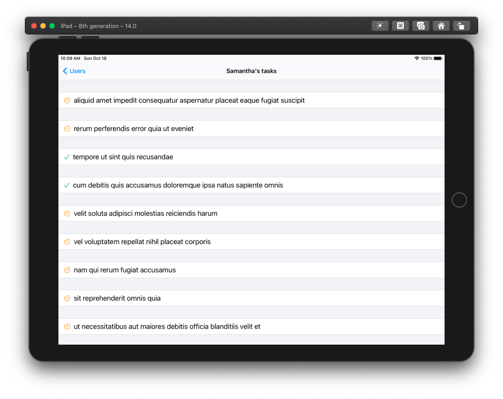

# Users

This app is meant to use a smiple API that list a bunch of users and their respective tasks :

Users endpoint: 
https://jsonplaceholder.typicode.com/users/

Tasks endpoint:
https://jsonplaceholder.typicode.com/todos?userId=1

### Result:

The App loads json data from the API then saves it locally using a realm database.

Here's the App running on iPad :

### Demo:

The app loads data from api first and then indicates using an icon which tasks have been saved locally.

Here's a video highlighting the use of the app with Internet Connection :

And with Offline use we use data stored in the Realm Database :

